# Learnification - Education Hub

The project, serving as the capstone project of a frontend bootcamp, revolves around crafting an interactive learning application that caters to users of diverse ages and skill levels. It aims to offer abroad spectrum of courses across various subjects, ensuring an engaging and enriching educational experience.

## Live Demo of the Project: 📹

- Live Project URL: [Learnification](https://learn-u-team-7.vercel.app/)

## Technologies, Frameworks and Libraries: ☕️ 🐍 ⚛️

- **Technology Stack:** Develop a dynamic learning platform using React-based web app with Next.js. Implement Tailwind CSS for a sleek, responsive design, and utilize MongoDB for efficient data storage.
- **Collaborative Development:** Adopt a Git workflow for collaborative development, ensuringcode quality, version control, and streamlined teamwork among the development team.
- **User-Centric Design:** Enhance the user experience through internationalization using Next-Intl,enabling users from various regions to access and interact with the platform in their preferred language.
- **Secure Access:** Ensure secure user access and authentication by integrating Next-Auth, providing a robust authentication system for user data and account management.

- [Next.js](https://nextjs.org/), [React](https://react.dev/)
- [MongoDB Atlas](https://www.mongodb.com/atlas/database) for database
- [Amazon Web Service](https://aws.amazon.com/) for cloud image store
- [Material UI](https://mui.com/) for react components
- [Next-Auth](https://next-auth.js.org/) for authentication
- [Next-Intl](https://next-intl-docs.vercel.app/) for internationalization
- [Tailwind css](https://tailwindcss.com/) for styling
- [React Player](https://www.npmjs.com/package/react-player) for video players
- [React Toastify](https://www.npmjs.com/package/react-toastify) for notifications
- [Jest](https://jestjs.io/) for testing

## Features: 📖

- User authentication (Sign Up, Login, Log Out, Auth).
- Course searching functionality with advanced filtering options.
- Saving courses for later reference.
- Watching lesson videos
- ...and more!

  
## Screenshots: 📷

### Main Page
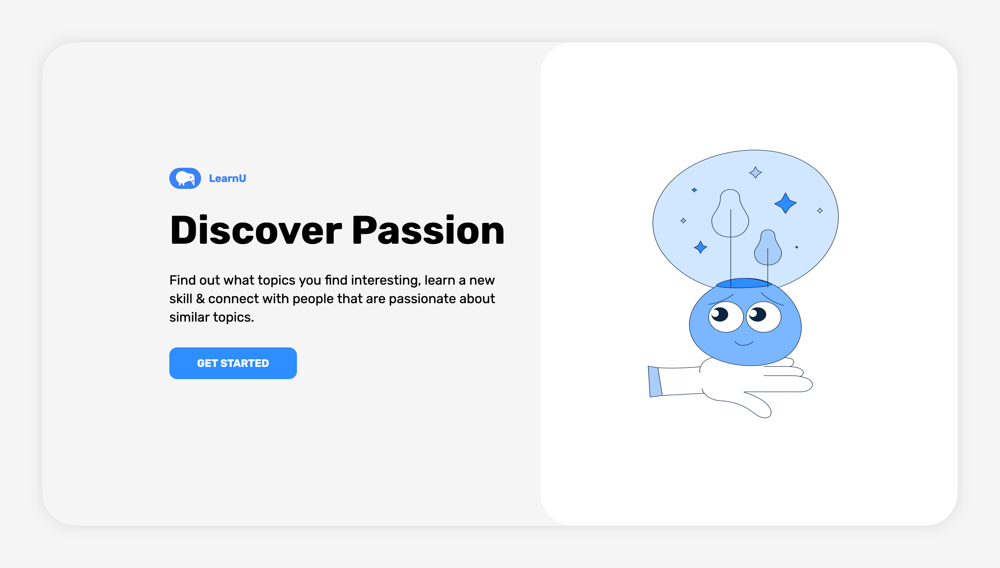

### Home Page 
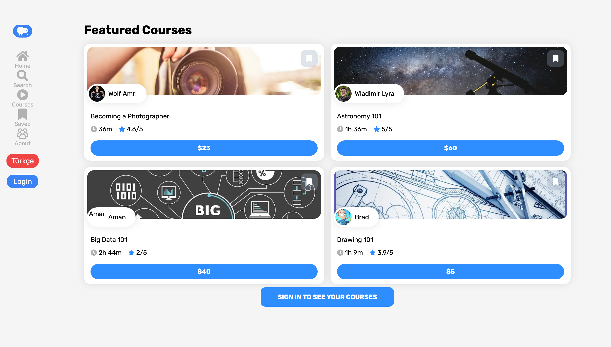

### Login Page
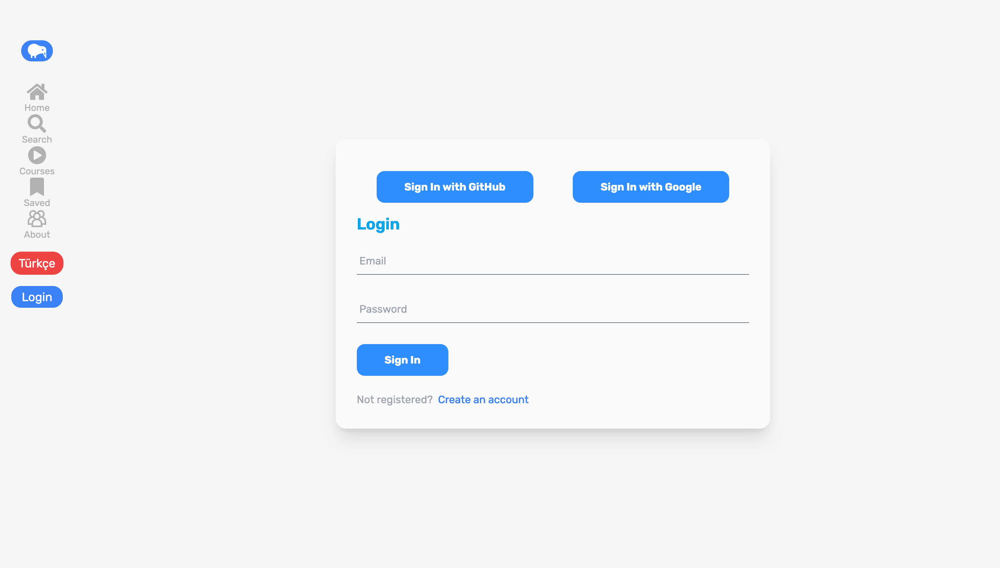

### Register Page
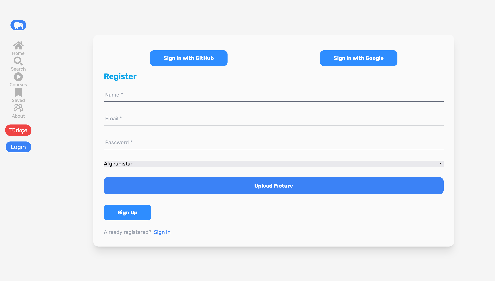

### Search Page
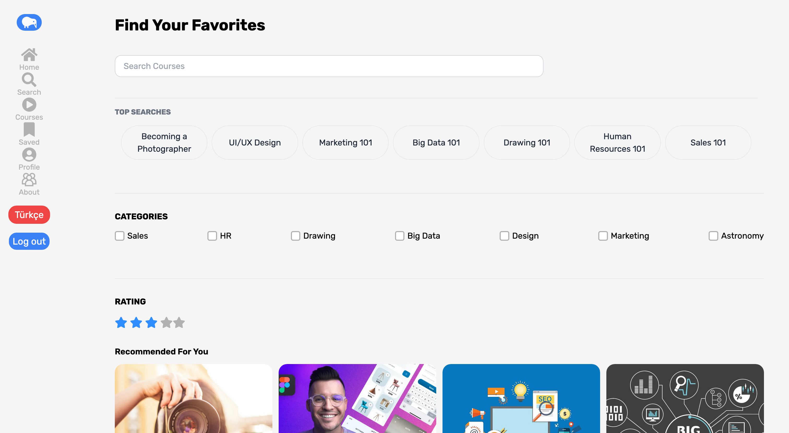

### Courses Page
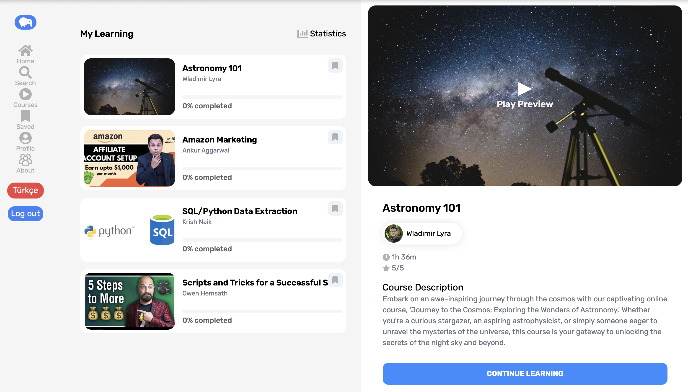

### Saved Courses Page
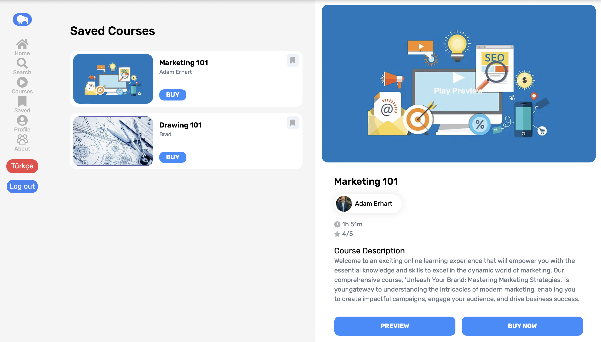

### Statistics Page
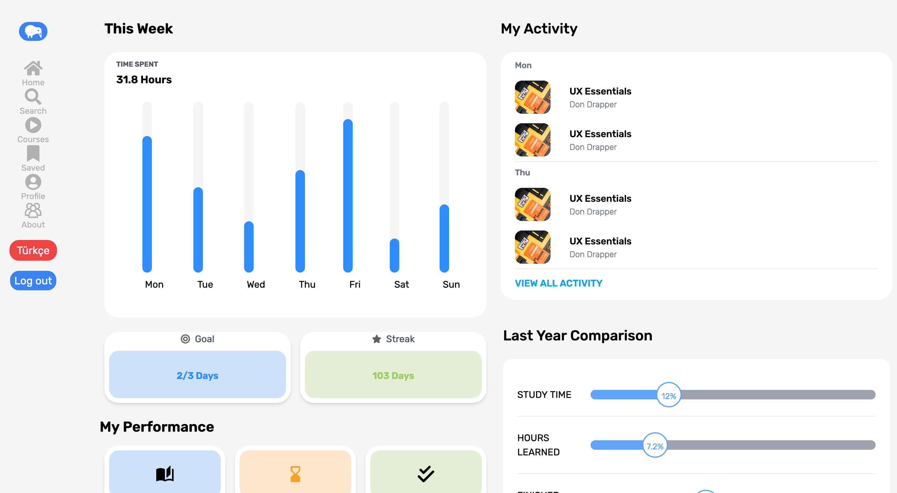

### Single Course Page
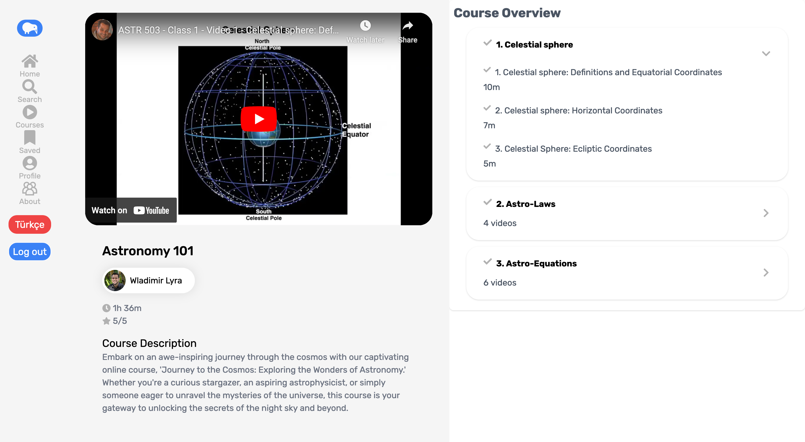

### Saved Courses Page with No Course Saved
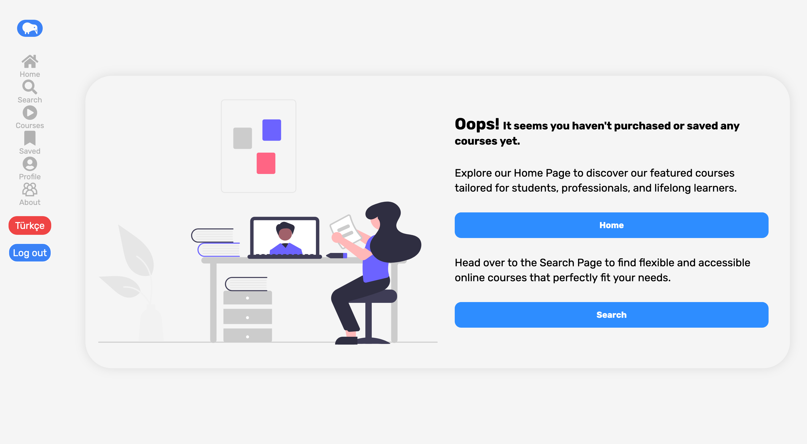

### Profile Page
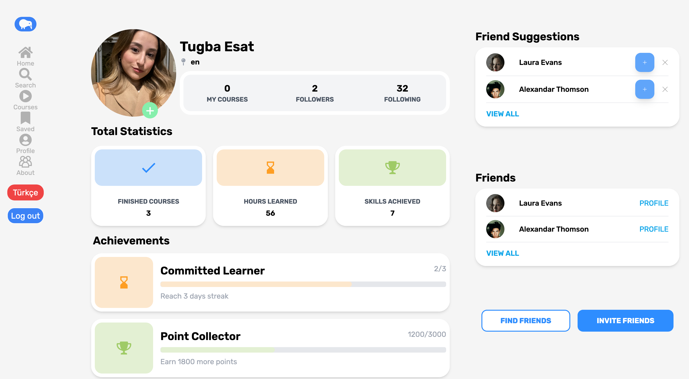

### About Us Page
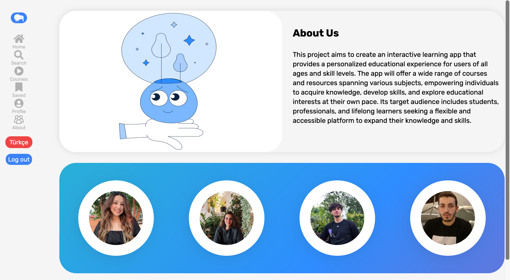

### About Us Page - Turkish
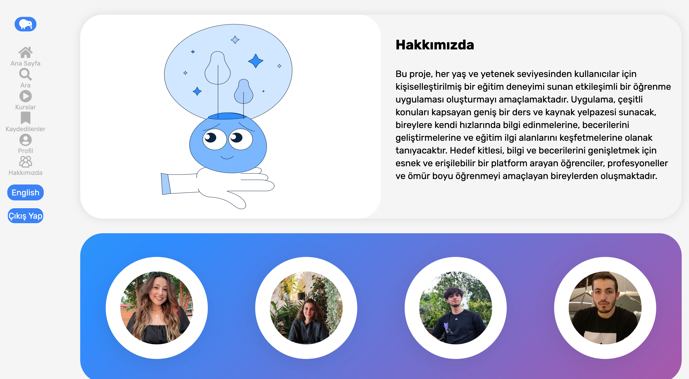

## Authors: 💻
- Tugba Esat Sahin [@tugbaesat](https://github.com/tugbaesat)
- Ebla Ekerdiker [@eblaekerdiker](https://github.com/eblaekerdiker)
- Amdjed Belgacem [@AmdjedBelgacem](https://github.com/AmdjedBelgacem)
- Furkan Cengiz [@4Furki4](https://github.com/4Furki4)
